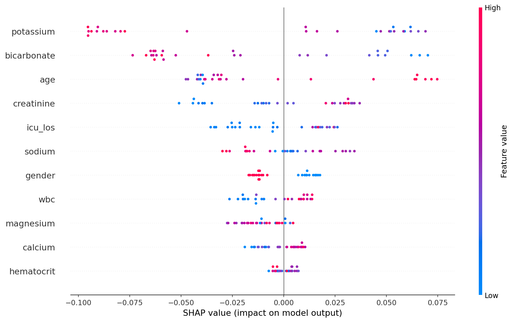

# ICU Mortality Prediction using Machine Learning

## What is this project?
This project predicts whether an ICU patient will survive their hospital stay 
using clinical data from the first 24 hours of admission.

Built using the publicly available MIMIC-III demo dataset so anyone can 
run it without needing credentials.

> **Note:** This project was also tested on the full MIMIC-III dataset 
> (~50,000 patients) where Random Forest achieved a recall of 0.698, 
> meaning it correctly identified 70% of patients who died.

## Dataset
- **Source:** [MIMIC-III Clinical Database Demo](https://physionet.org/content/mimiciii-demo/1.4/)
- **Size:** ~100 patients (demo) | 50,000+ patients (full dataset)
- **Features:** Age, gender, ICU length of stay, and lab values from first 24 hours
  (creatinine, sodium, potassium, hematocrit, WBC, magnesium, calcium, bicarbonate)
- **Target:** `hospital_expire_flag` — 1 if patient died, 0 if discharged alive

## Why This Problem?
Standard accuracy is misleading here — if a model predicts everyone survives, 
it gets 88% accuracy but misses every death. In healthcare, missing a death 
is far worse than a false alarm. So we optimize for **recall**.

## Models
| Model | Approach |
|-------|----------|
| Logistic Regression | Simple baseline |
| Random Forest | Best recall — selected as final model |
| XGBoost | Best AUC-ROC |

## Results (Demo Dataset)
| Model | Recall | AUC-ROC |
|-------|--------|---------|
| Logistic Regression | 0.375 | 0.475 |
| Random Forest | 0.500 | 0.581 |
| XGBoost | 0.625 | 0.713 |

## What Makes This Different
Most mortality prediction projects stop at the classification report. 
This project adds **SHAP explainability** — showing exactly which features 
drove each prediction. This matters in healthcare because doctors need to 
understand *why* before acting on a model's output.

## How to Run
1. Download MIMIC-III demo data from [physionet.org](https://physionet.org/content/mimiciii-demo/1.4/)
2. Upload `PATIENTS.csv`, `ADMISSIONS.csv`, `ICUSTAYS.csv`, `LABEVENTS.csv` to your Google Drive
3. Open the notebook in Google Colab
4. Run all cells in order

## Tech Stack
- Python, pandas, scikit-learn, XGBoost, SHAP, matplotlib

## SHAP Feature Importance

